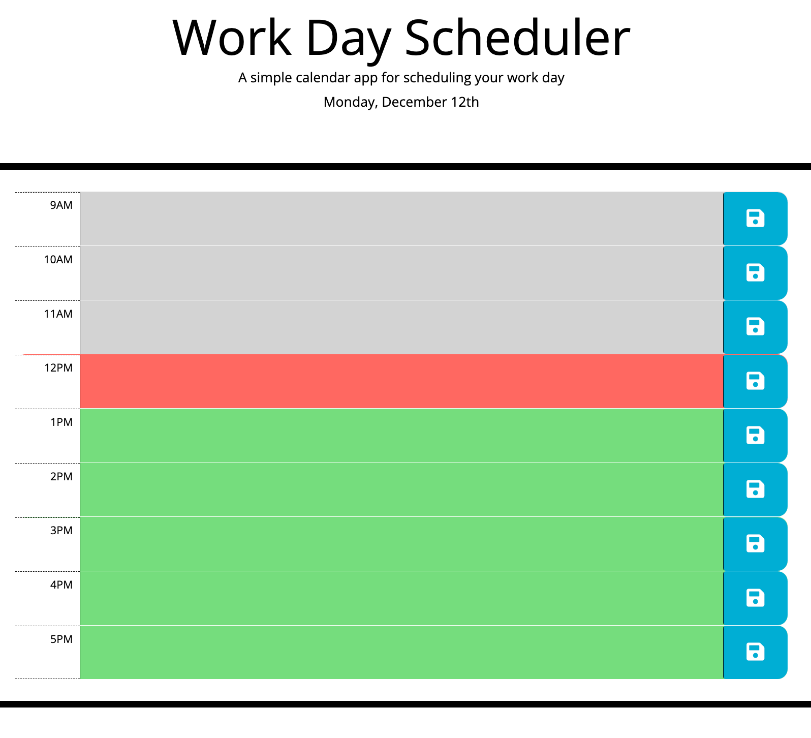
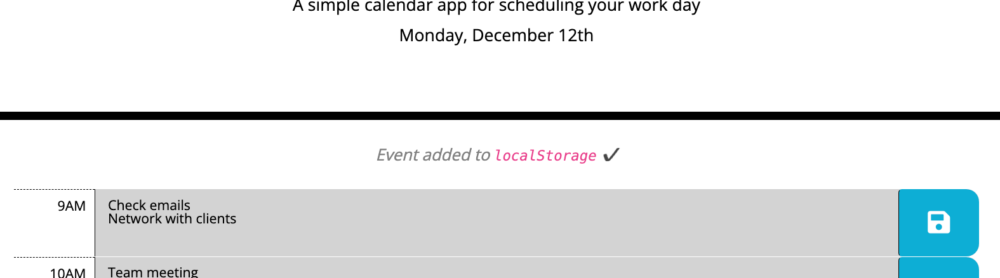
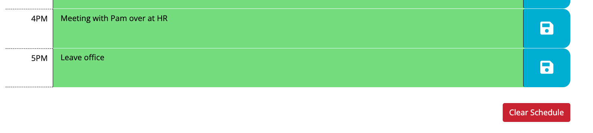

# Workday Scheduler

<!-- 

 -->

    

## Description

A simple calendar application that allows a user to save events for each hour of the current working day.

This app was built to further my understanding of how to:

- use the [jQuery](https://jquery.com/) library to envelope DOM elements, giving access to their methods which can make traversal, manipulation and event handling easier
- create time-based operations using [Moment.js](https://momentjs.com/)

## Usage

The application is accessible by navigating to the link below.

https://hilarious-torte-daaee3.netlify.app/

The user is presented with a schedule that displays a block of time representing one hour for each row. Time blocks begin from 9am up to (and including) 5pm, that is, it shows the current "working day".

Each time block is coloured according to whether it includes the current time (red), a previous time (grey) or a future time (green).

Users can store an event by entering text into the time block's text area and then clicking the save button on the right.

There are checks to ensure the user has entered an event or not tried saving the same event in that hour again. If valid, the event is saved to the browser's local storage and an appropriate feedback message is shown. So, if the user refreshes the page or closes the app and comes back later that day, the events that were entered will persist in the schedule.

Users can clear the schedule by clicking the 'Clear Schedule' button on the bottom right of the page.

> **Warning**: the quiz includes short feedback sounds for when an event is saved and when the schedule is cleared.

## Credits

[ChatGPT](https://chat.openai.com) is pretty amazing (but also scarily depressing?). Using it helped to quickly answer questions on how to do some of the basic specific things and thus saved some time with scrolling through and searching the [jQuery docs](https://api.jquery.com/) or [Stack Overflow](https://stackoverflow.com) posts, although the latter two were still needed.

Other credits:

- [GabrielAraujo - powerup/success.wav \[freesound\]](https://freesound.org/people/GabrielAraujo/sounds/242501/)
- [philberts - trash_fall.wav \[freesound\]](https://freesound.org/people/philberts/sounds/71512/)
- [Markdown Badges \[GitHub\]](https://github.com/Ileriayo/markdown-badges)
- [Custom Badges \[GitHub\]](https://gist.github.com/afig/be5ab20c50062dba7cb835e30206659a)
- [shields.io](https://shields.io/)

The base HTML and CSS were provided by the course and not created by myself.

## License

Licensed under the [MIT](https://opensource.org/licenses/MIT) license.

## Badges

